# MyStravaStats

MyStravaStats is a personal data analysis project built using Jupyter Notebook and Python to visualize and understand personal fitness trends using exported Strava activity data. This project offers comprehensive insights through interactive plots and statistics for various types of activities (running, cycling, hiking, etc.).

## Insights You Can Discover

- Are you improving your speed or distance over time?
- Which days of the week are you most active?
- Are there patterns in your activity start times?
- What type of activity do you perform most often?
- Which regions (e.g., USA vs. Poland) are most common for your rides?
- Are there seasonal trends in your activity levels?

## Features

- **Activity Summary**: View total activities, duration, and distance metrics.
- **Monthly and Weekly Trends**: Track your pace, speed, and distance over time.
- **Heatmaps**: Visualize what times and days you're most active.
- **Streaks & Rest Days**: Identify your longest streaks and recovery periods.
- **Activity Frequency**: Analyze how often you work out each day of the week.
- **Pie Charts**: See your most common types of workouts.
- **Time Zone Support**: Adjusts timestamps to your local time (e.g., EST).

## Project Structure

```plaintext 
├── assets/   
│   ├── api_application.png
│   ├── api_page.png
│   └── main_page.png
├── plots/
│   ├── activities_per_weekday.png
│   ├── activity_start_times_heatmap.png
│   ├── all_activities_pi_chart_distribution.png
│   ├── correlation_heatmap.png
│   ├── interactive_clean.html
│   ├── interactive_detailed.html
│   ├── interactive_routes_clean.html
│   ├── interactive_routes_detailed.html
│   ├── monthly_average_speed.png
│   ├── monthly_distance.png
│   ├── monthly_elevation_gain.png
│   ├── monthly_moving_hours.png
│   ├── poland_activities.png
│   ├── power_output_per_ride.png
│   ├── power_zone_frequency.png
│   ├── usa_activities.png
│   ├── weekly_average_speed.png
│   ├── weekly_distance.png
│   ├── weekly_elevation_gain.png
│   └── weekly_moving_hours.png
├── strava_analysis.ipynb
├── strava_activities.csv      
├── power_zone_summary.csv              
└── README.md
```

## Setup Instructions

### Strava API

Visit the strava developers page https://developers.strava.com, and you should click on the **Create & Manage Your App** link as is shown in the screenshot below: 

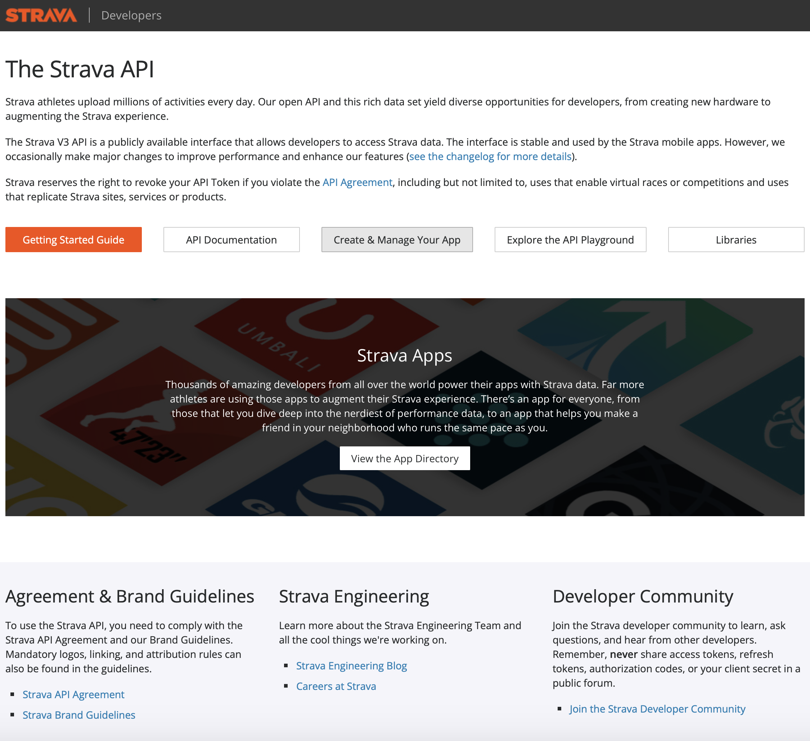

You are then redirected to https://www.strava.com/settings/api, where you set up your API Application. You should see a screen as is shwon in the screenshot below:

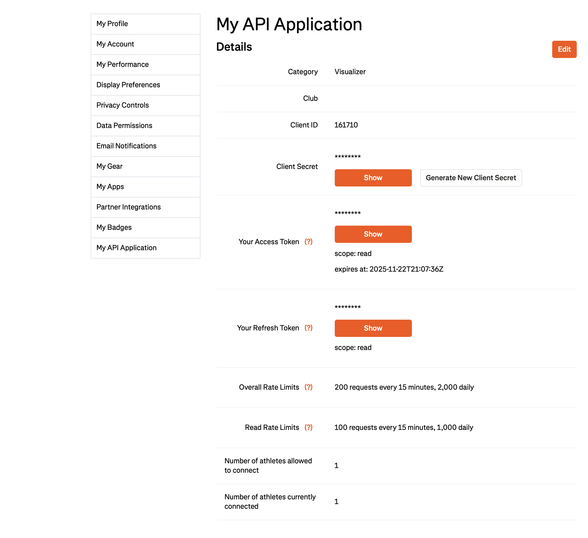

Before the client ID, client secret, and access token is generated, you fill out an application regarding what you will be using the Strava API for. You will need to provide an Application Name, the category it will belong to, a club it will be be part of (optional), a website it should be connected to, an application description (optional), as well as provide the Authorization Callback Domain, which should be localhost or 127.0.0.1 for simplicity. Below is a screenshot of what it should look like. Once evrything is set up, you can begin programming in the Jupyter Notebook. 

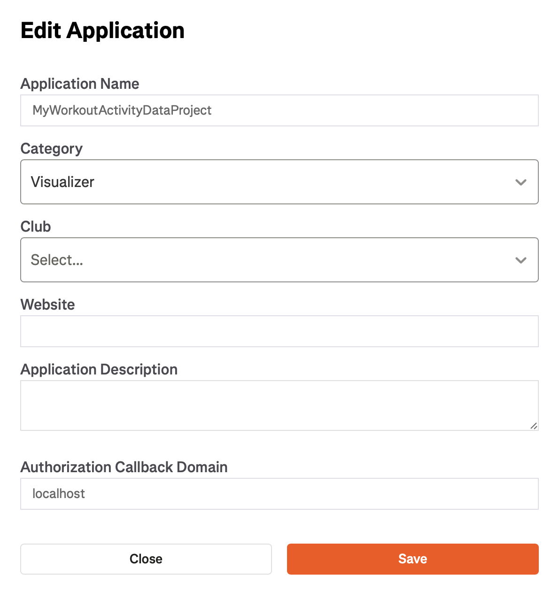

### Prerequisites

Ensure you have the following installed:

- Python 3.7+
- Jupyter Notebook or Jupyter Lab

You can install the required Python packages using:

```bash
pip install webbrowser pandas geopandas numpy matplotlib polyline folium pathlib seaborn
```

## Customization Tips

- To change the time zone, update the `.tz_convert()` line in the notebook.
- You can filter activities by type (e.g., only cycling) by modifying the DataFrame filters.
- Add support for other visualizations like heart rate, calories burned, or elevation.
- Customize plots with your preferred color schemes or styles using Matplotlib/Seaborn options.

## Data Privacy

Your Strava data remains local and is never uploaded or shared. If publishing this notebook, make sure to remove or anonymize sensitive data such as location details or GPX files.

## Sample Plots

### Activity Frequency Heatmap
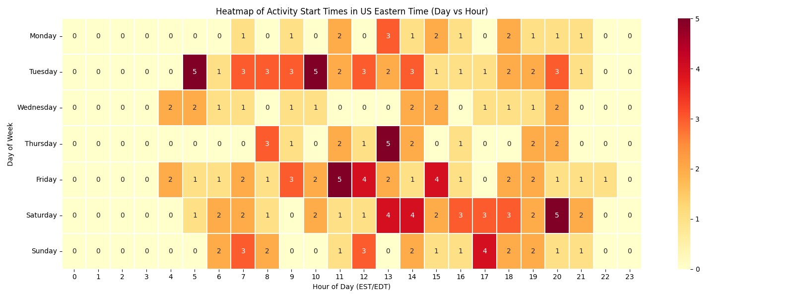

### Weekly Average Speed Overview
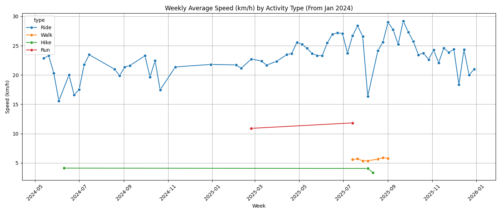

### Weekly Distance Overview
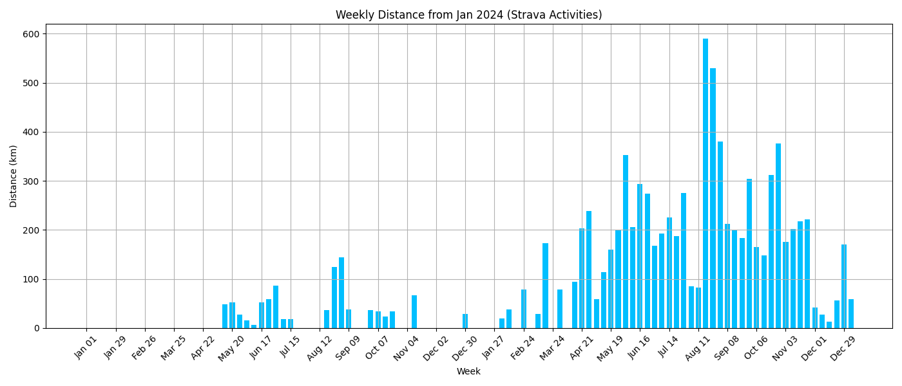

### Weekly Elevation Gain Overview
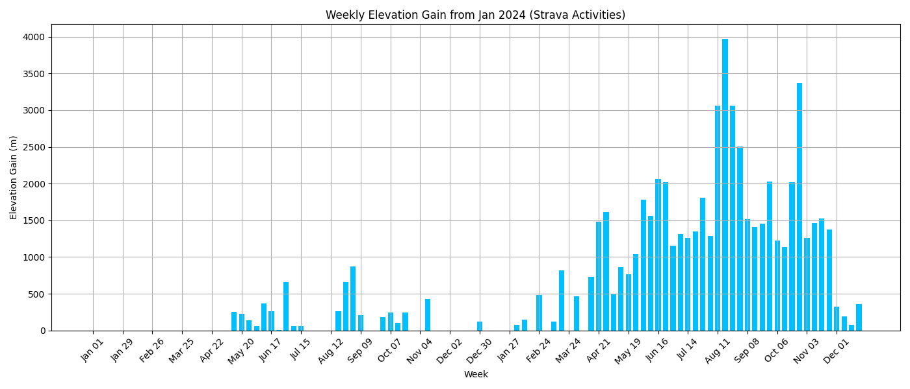

### Weekly Moving Hours Overview
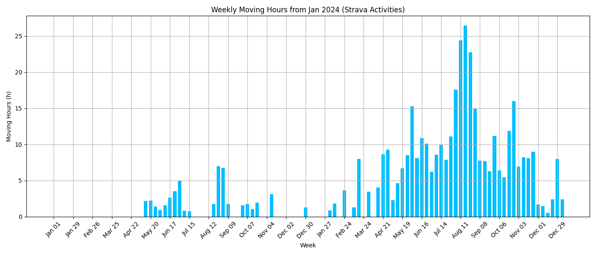

### Common Workouts
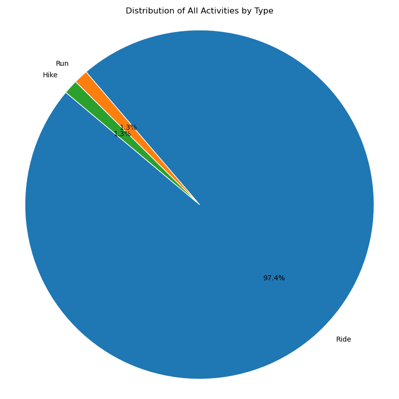

### Locations of Activities 
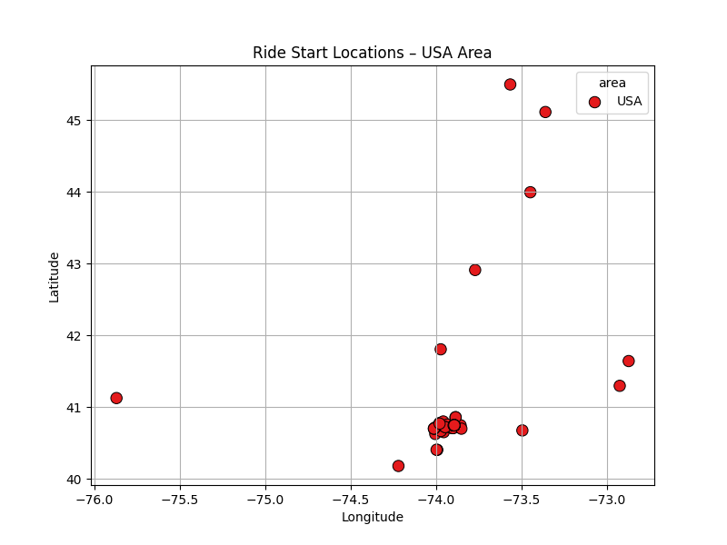
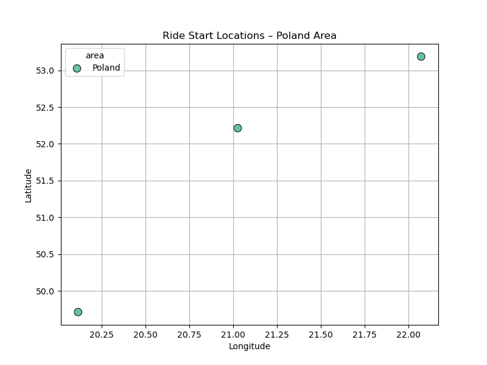

## Map Visualizations

This project includes interactive HTML maps for route visualizations:

- `interactive_routes_clean.html`: Simplified visual of GPS routes.
- `interactive_routes_detailed.html`: Detailed map view of rides.

### Interactive Clean Map

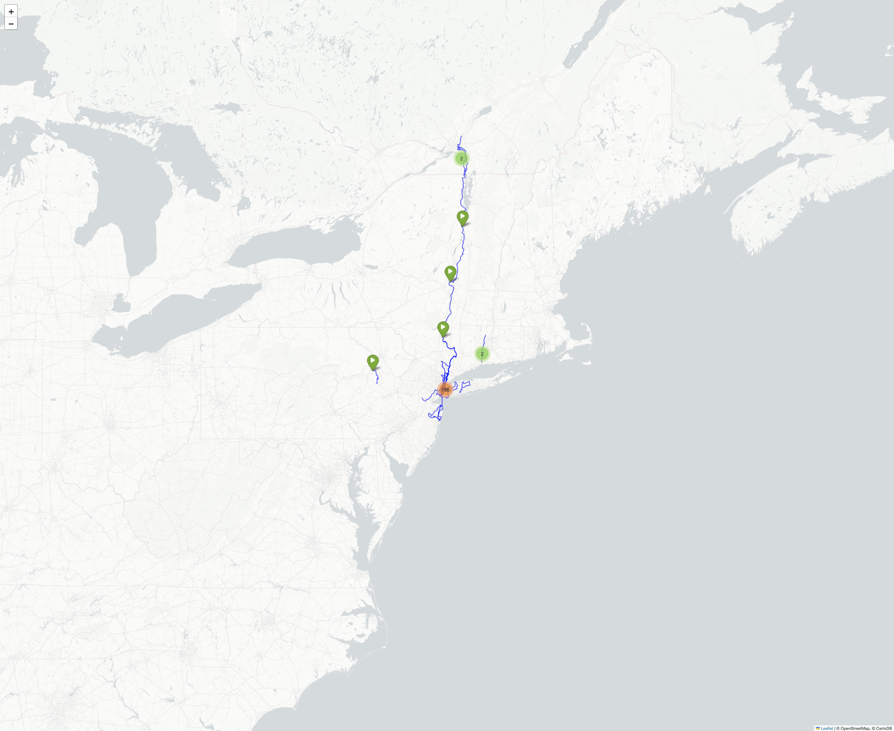

### Interactive Detailed Map


## Limitations and Future Improvements

- Currently supports only activities with GPS data.
- Does not include heart rate data (yet).
- Future plans:
  - Add performance trendlines and forecast models for upcoming weeks, months & years. 
  - Implement goal tracking and achievement detection.
  - Enable (overall) comparisons between years.
